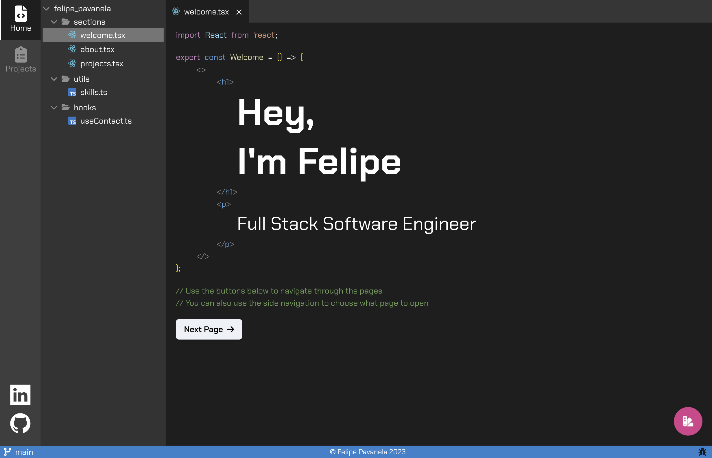

# 💻 Felipe Pavanela's Portfolio

This website is built with [Remix](https://remix.run/) and hosted with [Vercel](https://vercel.com/).

 

  

## ⚒️ Main tools

 

### 🎨 Styling: [chakra-ui](https://chakra-ui.com/)

Chakra-ui provides layout components that speed up development, such as `<Flex />`, `<Grid />` and `<Stack />`. And multiple out of the box utilities components, such as `<Text />`, `<Image />` and `<Button />`, as well as more complex components such as `<Drawer />` and `<Skeleton />`.

Also, chakra-ui allows me to have multiple themes, instead of just the classic light and dark. Since this website is inspired on a code editor, I thought it'd be important to be able to handle multiple themes.

 

### 🦄 Animations: [Framer Motion](https://www.framer.com/motion/)

Framer Motion makes animation super simple on React. It provides from basic element animation, to transitions, gestures and scrolling animations. It also provides synchronous mount/unmount animations.

At the same time Framer Motion is very customizable, it also provides some built in animated components, such as `drag-to-reorder`.

 

### 🎭 Icons: [fortawesome](https://fontawesome.com/)

Most icons are from FontAwesome since it provides a pretty good range of icons. Other icons such as TS and React logos, were added as png.

 

### 🧑🏽‍🚒 Helpers

To save development time, I opted to use some helper libraries.

- [usehooks-ts](https://usehooks-ts.com/): Provides many useful React hooks.

- [lodash](https://usehooks-ts.com/): Provides multiple JS utility functions.